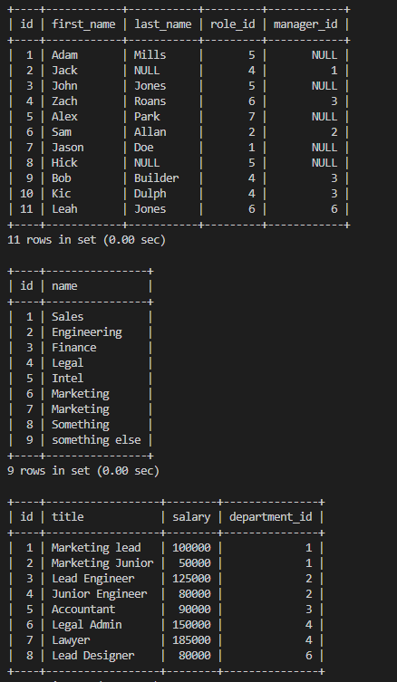
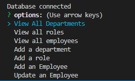
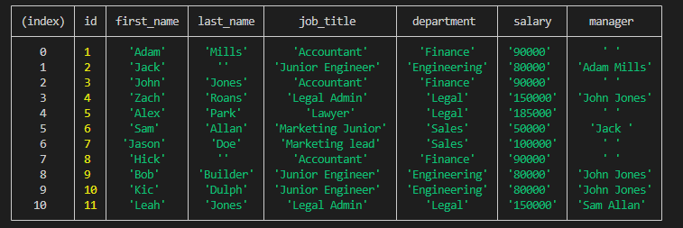
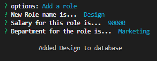
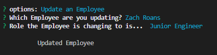

# Content-Management-System-SQL

Design a content management system using NodeJS, Inquirer and SQL

## Table of Content

- [Walkthrough](#walkthough)
- [User Story & Acceptance Criteria](#user-story)
- [What I have learnt](#what-i-have-learnt)
- [Installation](#installation)
- [Usage](#usage)

## Walkthough

[Walkthrough Video](youtube.com)

## User Story

```md
AS A business owner
I WANT to be able to view and manage the departments, roles, and employees in my company
SO THAT I can organize and plan my business
```

## Acceptance Criteria

```md
GIVEN a command-line application that accepts user input
WHEN I start the application
THEN I am presented with the following options: view all departments, view all roles, view all employees, add a department, add a role, add an employee, and update an employee role
WHEN I choose to view all departments
THEN I am presented with a formatted table showing department names and department ids
WHEN I choose to view all roles
THEN I am presented with the job title, role id, the department that role belongs to, and the salary for that role
WHEN I choose to view all employees
THEN I am presented with a formatted table showing employee data, including employee ids, first names, last names, job titles, departments, salaries, and managers that the employees report to
WHEN I choose to add a department
THEN I am prompted to enter the name of the department and that department is added to the database
WHEN I choose to add a role
THEN I am prompted to enter the name, salary, and department for the role and that role is added to the database
WHEN I choose to add an employee
THEN I am prompted to enter the employee’s first name, last name, role, and manager, and that employee is added to the database
WHEN I choose to update an employee role
THEN I am prompted to select an employee to update and their new role and this information is updated in the database
```

## What I have learnt

It has been a very interesting week learning SQL and I have really enjoyed learning something quite challenging and different. SQL is Structured Query Language that allows
you to query your database easily and efficently. It is a lot different to traditional coding as it tries to read like a book with statements like SELECT, WHERE and ORDER BY.
This can actually get sometimes confusing as I am very used to the if and else of the world in Javascript but once I had got the hang of it, it was very nice to work with and simple.

The only hard part I believe for this week was getting Inner joins and left joins to fully work and to fully understand how they work but once you do the first couple joins
you start to get a bigger understanding of how to manipulate the data. Furthermore, this is the first week I have dealt with using promises, as I have to wait for the data from the database to come back and it was strange at first with the rejects and resolves but after doing it a couple times, it was really nice to be able to use .then() to
give a structure to the code and know that the code is going to run in the direction you want.

## Installation

Clone the project and then to use the test data you need and to setup the database (MYSQL)[https://www.mysql.com/]

After that in the terminal do in the project:

```bash

mysql -u root -p

```

Put in the password you have set.

Then do:

```bash
source db/schema.sql;
source db/seed.sql;
```

And to see if it was successful do:

```bash

source db/query.sql;
```

Should return data like this:



Then to use the app do:

```bash
npm i;

npm run start;
```

## Usage

Once everything has been setup you are able to do many things.



### View Statements

All the view statements will show you what your database looks like in formatted style

Below is the view Employees:



### Add statements

All the add statements will allow to add a new Employee, role or department into the database.

Below is the add role:



### Update Statement

At the current moment you can only update Employees roles.

This will ask for the employee you want to update and the role the employee is changing to.


